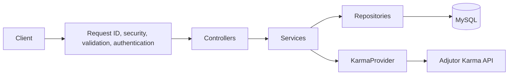
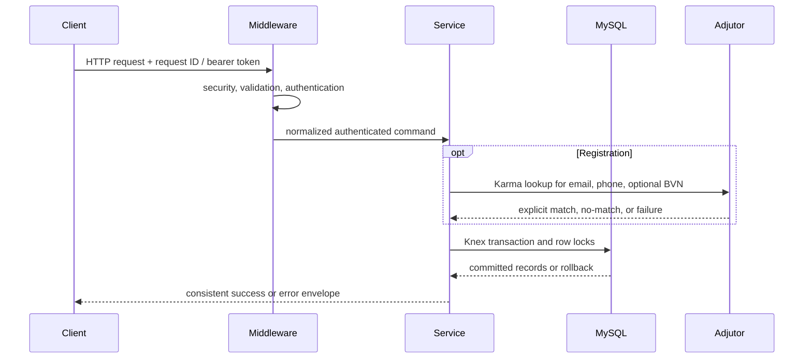
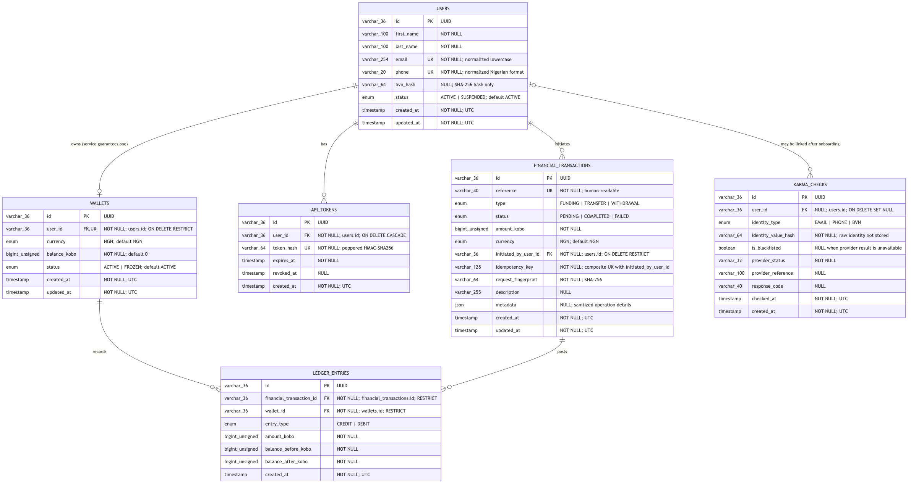
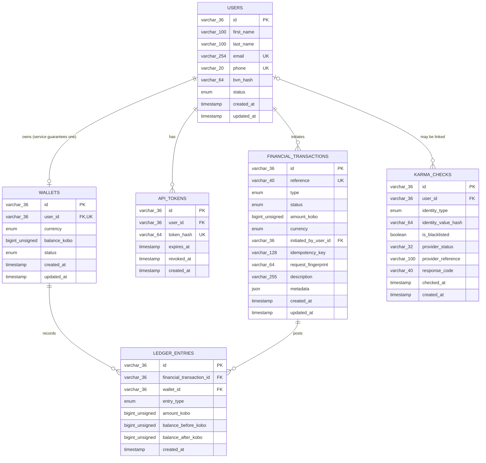

# Demo Credit Wallet Service

## Live API URL

`https://ukachi-charles-lendsqr-be-test.onrender.com`

- Health: `https://ukachi-charles-lendsqr-be-test.onrender.com/health`
- Readiness: `https://ukachi-charles-lendsqr-be-test.onrender.com/ready`
- Swagger UI: `https://ukachi-charles-lendsqr-be-test.onrender.com/api-docs`

## GitHub Repository URL

[https://github.com/ukcharlies/ukachi-charles-lendsqr-be-test](https://github.com/ukcharlies/ukachi-charles-lendsqr-be-test)

## Project Overview

Demo Credit Wallet Service is a production-minded backend assessment project for Lendsqr. It exposes a versioned REST API for eligibility-controlled account creation, NGN wallets, simulated funding and withdrawal, wallet-to-wallet transfers, balance lookup, and transaction history. It is a strict TypeScript modular monolith using Express, Knex, and MySQL; no frontend or ORM is included.

## Assessment Requirements Covered

- Creates a user only after checking every supplied identity with Adjutor Karma.
- Creates exactly one NGN wallet and one faux bearer token with an eligible user.
- Supports funding, transfer, withdrawal, balance, profile, and transaction-history APIs.
- Stores money as unsigned integer kobo and safely handles mysql2 BIGINT strings.
- Uses Knex migrations, repositories, service-owned transactions, and deterministic row locking.
- Enforces bearer authentication, ownership, idempotency, input validation, and consistent errors.
- Provides unit tests, HTTP tests, MySQL lifecycle tests, coverage, CI, Swagger, Postman, Docker, ERD, and deployment assets.

## Assumptions and Scope

- Funding and withdrawals are confirmed simulations because no payment gateway or banking provider was supplied.
- NGN is the only supported currency.
- BVN is optional and stored only as a non-reversible SHA-256 hash.
- The raw faux API token is returned once at registration; the database stores only its peppered HMAC-SHA256 digest.
- Adjutor ambiguity, timeout, authentication failure, rate limiting, or an unfamiliar payload fails closed and prevents onboarding.
- This is a single-service assessment implementation, not licensed banking software.

## Technology Choices

| Area             | Choice                                                       |
| ---------------- | ------------------------------------------------------------ |
| Runtime          | Node.js 24 LTS and npm                                       |
| Language         | TypeScript strict mode                                       |
| HTTP             | Express 5                                                    |
| Database         | MySQL 8 with mysql2                                          |
| Query/migrations | KnexJS                                                       |
| Validation       | Zod                                                          |
| Logging          | Pino and pino-http                                           |
| External HTTP    | Axios                                                        |
| Security         | Helmet, restricted CORS, rate limiting, HMAC token hashes    |
| Tests            | Jest, ts-jest, Supertest, Nock, real MySQL integration suite |
| Documentation    | OpenAPI 3.1, Swagger UI, Mermaid, DBML, Postman              |

## Architecture

The application is a layered modular monolith. Controllers translate HTTP, services own business rules and transaction boundaries, repositories contain Knex queries, and provider adapters isolate third-party contracts. Constructor injection keeps the Karma provider and repositories mockable.



```text
src/
├── common/          errors, middleware, money/identity helpers, presenters
├── config/          validated environment, database config, logger
├── database/        Knex connection, migration runner, migrations
├── modules/         auth, users, wallets, transactions, Karma
├── routes/          versioned API composition
├── app.ts           Express composition root
└── server.ts        HTTP startup and graceful shutdown
```

## Request Flow



Registration validates and normalizes input, checks uniqueness, calls Karma for every supplied identity, then creates the user, wallet, and token inside one transaction. Wallet mutations derive the source wallet from the authenticated user, never a request-body user or wallet ID.

## ER Diagram



The PNG is rendered from [docs/erd.mmd](docs/erd.mmd), with a portable [DBML version](docs/erd.dbml). Both were reconciled against `202607170001_initial_schema.ts`.



## Database Design

- `users`: normalized identity and account status; raw BVN is never stored.
- `wallets`: unique `user_id` enforces at most one NGN wallet per user; the service guarantees creation.
- `api_tokens`: peppered HMAC token hashes with expiry and optional revocation.
- `financial_transactions`: unique reference, amount, type/status, initiating user, request fingerprint, and unique `(initiated_by_user_id, idempotency_key)`.
- `ledger_entries`: append-only credit/debit movements with before/after balances.
- `karma_checks`: sanitized eligibility audit; `user_id` remains nullable when onboarding never completes.

Foreign keys restrict deletion of financial history, cascade tokens with deleted users, and set Karma user references to null. Indexed ownership and timestamp columns support authentication and history queries.

## API Endpoint Documentation

| Method | Endpoint                          |         Auth | Purpose                                              |
| ------ | --------------------------------- | -----------: | ---------------------------------------------------- |
| GET    | `/health`                         |           No | Process liveness                                     |
| GET    | `/ready`                          |           No | MySQL readiness                                      |
| GET    | `/api-docs`                       |           No | Swagger UI                                           |
| POST   | `/api/v1/users`                   |           No | Karma-controlled account, wallet, and token creation |
| GET    | `/api/v1/users/me`                |       Bearer | Current user                                         |
| GET    | `/api/v1/wallets/me`              |       Bearer | Wallet and formatted balance                         |
| POST   | `/api/v1/wallet-fundings`         | Bearer + key | Simulated atomic funding                             |
| POST   | `/api/v1/transfers`               | Bearer + key | Atomic wallet transfer                               |
| POST   | `/api/v1/withdrawals`             | Bearer + key | Simulated atomic withdrawal                          |
| GET    | `/api/v1/transactions`            |       Bearer | Paginated/filterable involved history                |
| GET    | `/api/v1/transactions/:reference` |       Bearer | Involved transaction only                            |

The canonical contract, schemas, headers, examples, and statuses are in [docs/openapi.yaml](docs/openapi.yaml).

## Authentication Instructions

Successful registration returns a cryptographically random token once:

```json
{
  "success": true,
  "data": {
    "token": "opaque-registration-token",
    "tokenType": "Bearer"
  }
}
```

Send it on protected requests:

```http
Authorization: Bearer <opaque-registration-token>
```

The middleware hashes the supplied token with `AUTH_TOKEN_PEPPER`, finds a non-revoked/unexpired token, loads an active user, and derives wallet ownership from that identity. This user token is separate from the server-only `ADJUTOR_API_KEY`.

## Adjutor Karma Integration

Registration calls `GET /v2/verification/karma/{identity}` for normalized email, phone, and optional BVN using the server-side Adjutor bearer key. A populated `karma_identity` or explicit blacklist flag returns `403 ONBOARDING_NOT_ALLOWED`. Provider 404 is treated as no match. Timeout, 401/403, 429, server error, empty `{}`, or unfamiliar success payload returns `503 ELIGIBILITY_CHECK_UNAVAILABLE` and no user is created. Raw identities and full provider payloads are not persisted or logged.

The current Adjutor test app has returned HTTP 200 with `{}` during manual checks. The service intentionally fails closed until Adjutor confirms the sandbox response contract.

## Transaction and Concurrency Handling

- Public money values are positive decimal strings with at most two decimal places; string parsing converts them to integer kobo.
- Funding locks one wallet with `FOR UPDATE`, credits it, and writes one ledger entry in one transaction.
- Withdrawal locks one wallet, checks the post-lock balance, debits it, and writes one ledger entry.
- Transfer resolves both wallets, sorts wallet IDs, locks both deterministically, checks funds after locking, debits/credits, and writes two ledger entries.
- Any error rolls back the financial transaction, wallet changes, and ledger entries together.
- Every mutation requires `Idempotency-Key`. An identical retry returns the original transaction; changed input with the same key returns 409.

## Local Setup Instructions

Requirements: Node.js 24 LTS, npm, and Docker.

```bash
git clone https://github.com/ukcharlies/ukachi-charles-lendsqr-be-test.git
cd ukachi-charles-lendsqr-be-test
nvm use
cp .env.example .env
docker compose up -d mysql
npm ci
npm run knex:migrate
npm run dev
```

Open `http://localhost:5000/health`, `/ready`, and `/api-docs`. Do not use an Aiven production database for automated tests.

## Environment Variables

| Variable                                                    | Purpose                              |
| ----------------------------------------------------------- | ------------------------------------ |
| `NODE_ENV`, `PORT`, `LOG_LEVEL`                             | Runtime and platform port            |
| `DB_HOST`, `DB_PORT`, `DB_NAME`, `DB_USER`, `DB_PASSWORD`   | MySQL connection                     |
| `DB_SSL`, `DB_SSL_CA_BASE64`                                | Aiven TLS with CA decoded in memory  |
| `DB_POOL_MIN`, `DB_POOL_MAX`                                | Knex pool bounds                     |
| `ADJUTOR_BASE_URL`, `ADJUTOR_API_KEY`, `ADJUTOR_TIMEOUT_MS` | Karma provider                       |
| `AUTH_TOKEN_PEPPER`, `AUTH_TOKEN_TTL_DAYS`                  | Faux bearer-token hashing and expiry |
| `CORS_ORIGINS`                                              | Comma-separated browser origins      |

`.env` and `ca.pem` are ignored. Production secrets belong in Render secret environment variables, never GitHub or Postman.

## Database Migration Instructions

```bash
npm run knex:migrate
npm run knex:migrate:rollback
npm run knex:seed
npm run db:setup
```

The controlled production migration command is `node dist/database/migrate.js up`. Run it once before the new application revision receives traffic; do not let every replica race to migrate.

## Test Instructions

```bash
npm run format:check
npm run lint
npm run typecheck
npm test
npm run test:coverage
npm run build
```

For the MySQL lifecycle suite, use an isolated database whose name ends in `_test`, migrate it, set `RUN_MYSQL_INTEGRATION=true`, and run `npm test`. The suite creates unique users, exercises the full wallet lifecycle, and cleans up afterward. Current verified result: 44 tests passed with 89.28% statements, 61.83% branches, 93.75% functions, and 93.63% lines.

## Deployment Instructions

### Aiven MySQL

1. Create MySQL and copy host, port, database, user, password, and CA certificate.
2. Base64-encode the CA: `base64 < ca.pem | tr -d '\n'`.
3. Configure `DB_SSL=true` and place the encoded value in `DB_SSL_CA_BASE64`.
4. Run the controlled migration. The assessment Aiven `defaultdb` has been successfully migrated with `202607170001_initial_schema.ts`.

### Render

1. Open the repository's `render.yaml` as a Render Blueprint.
2. Supply `DB_PASSWORD`, `DB_SSL_CA_BASE64`, and `ADJUTOR_API_KEY` as secret values; Render generates `AUTH_TOKEN_PEPPER`.
3. Render builds the repository Dockerfile and supplies `PORT`; the application binds to `0.0.0.0`.
4. Apply the Blueprint and verify `/health`, `/ready`, `/api-docs`, and a safe registration attempt.
5. Blueprint syncs deploy later changes pushed to `main`.

The GitHub Actions workflow is a verification gate: it starts MySQL 8.4, migrates, lints, typechecks, tests with coverage, and builds. It does not itself keep the API online. Render Free spins down after inactivity and can delay a request by 50 seconds or more while waking; Aiven's assessment database is single-node and not SLA-backed. This free deployment is suitable for assessment review, not guaranteed production uptime.

## Security Considerations

- Helmet, restricted CORS, JSON size limit, rate limiting, strict Zod schemas, and parameterized Knex queries.
- Opaque 256-bit user tokens; only peppered HMAC hashes are stored.
- No raw BVN, database password, Adjutor key, token, full account number, or sensitive provider payload in logs.
- Server-side ownership; source user and wallet IDs are never accepted from the body.
- Database constraints supplement application checks.
- Aiven TLS validates the supplied CA.

See [docs/SECURITY_AND_API_REVIEW.md](docs/SECURITY_AND_API_REVIEW.md).

## Failure Handling

Custom application errors map to stable HTTP statuses and codes inside one response envelope containing the request ID. Production responses hide stacks. Pino logs the same request ID for tracing. Knex rolls back failed wallet operations. `/ready` returns 503 when MySQL is unavailable. Adjutor failures fail closed. Graceful SIGTERM/SIGINT handling stops HTTP acceptance and closes the database pool.

## Trade-offs

- Funding and withdrawal are synchronous simulations rather than external settlements.
- SHA-256 BVN storage prevents recovery but a keyed hash or envelope encryption would improve protection and controlled lookup.
- The ledger is append-only by service convention; MySQL permissions/triggers could further enforce immutability.
- The strict Adjutor adapter prioritizes safe onboarding over availability when the sandbox response is ambiguous.
- The modular monolith favors clarity and transactional consistency over premature microservices.

## Production Improvements

- Paid always-on API instances, at least two replicas, rolling deploys, and an SLA-backed multi-node database.
- Bounded deadlock retry tied to the same idempotency key.
- Asynchronous provider settlement, outbox/events, webhooks, reversals, and reconciliation jobs.
- Fraud/velocity rules, maker-checker controls, scoped token management, and secret rotation.
- Centralized logs, traces, latency/error/reconciliation metrics, alerts, backup/restore drills, and penetration testing.

## Postman or Swagger Documentation

- Swagger UI: `https://ukachi-charles-lendsqr-be-test.onrender.com/api-docs`
- OpenAPI source: [docs/openapi.yaml](docs/openapi.yaml)
- Postman collection: [Demo Credit Wallet Service](docs/postman/Demo-Credit-Wallet-Service.postman_collection.json)
- Postman environment: [Demo Credit Local](docs/postman/Demo-Credit-Local.postman_environment.json)
- Public Postman URL: `<publish manually and insert URL>`

Import both JSON files, select **Demo Credit Local**, and run Health, Readiness, Create user, Create recipient user, profile/wallet reads, funding, transfer, withdrawal, and history. Registration scripts store `authToken` and `secondUserToken`; funding stores `transactionReference`. Change `idempotencyKey` before every materially different mutation. Positive and negative saved examples are included, and the collection contains no backend secrets.

## License or Assessment Notice

This repository was created solely for the Lendsqr backend engineering assessment. It is provided for evaluation and demonstration, without warranty, and must not be treated as licensed banking or payment software. The user will manually publish the Postman collection and add its public link and any requested review/video links to the final submission.
