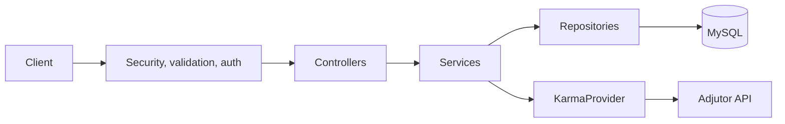
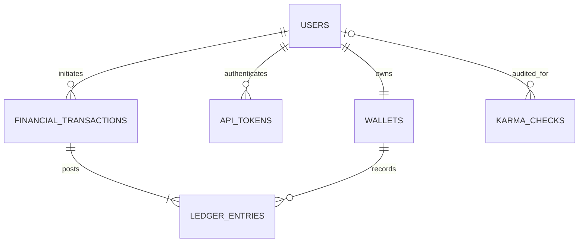

# Demo Credit Wallet Service

A small production-minded wallet backend built for the Lendsqr backend engineering assessment. It uses Node.js 24, strict TypeScript, Express, Knex, and MySQL—no frontend and no ORM. **Live API:** `https://<koyeb-service-url>` · **Swagger:** `/api-docs` · **Review document:** `<public-link>` · **Loom:** `<video-link>`

> Assessment-use disclaimer: this is a demonstration service, not licensed banking software. Funding and withdrawals are confirmed simulations because no payment or banking provider was supplied.

## Requirement checklist

- Account creation checks email, phone, and optional BVN against Adjutor Karma before any user is created.
- One NGN wallet and one opaque token are created atomically with each eligible user.
- Authenticated funding, transfer, withdrawal, balance, profile, and transaction-history APIs.
- Integer-kobo accounting, immutable ledger entries, row locks, deterministic transfer locks, rollback safety, and request idempotency.
- MySQL-only Knex migrations, strict Zod validation, Pino logging, central errors, Swagger UI, tests, Docker, CI, and Koyeb/Render assets.

## Architecture

This is deliberately a modular monolith. Controllers translate HTTP, services own business rules and transaction boundaries, repositories contain Knex queries, and the Adjutor adapter isolates a third-party contract. Constructor injection makes providers and repositories replaceable in tests.





`users` stores normalized identity and status; BVN is stored only as a non-reversible hash. `wallets` enforces one NGN wallet per user. `api_tokens` stores only peppered HMAC digests. `financial_transactions` is the business operation plus idempotency record. `ledger_entries` records each balance movement. `karma_checks` retains sanitized eligibility audit data.

## Financial and security design

The public API accepts money only as strings such as `"5000.00"`. String parsing converts naira to integer kobo; BIGINT values are requested from mysql2 as strings and converted to `bigint`, avoiding floating-point loss. Limits prevent overflow.

Funding locks one wallet, updates it, and posts one credit in one Knex transaction. Withdrawal locks, checks funds after the lock, debits, and posts one debit. Transfer finds both wallets, sorts their IDs, locks them in deterministic order, checks the sender after locking, then posts a debit and credit. Any error rolls back every write; balances cannot go negative.

Every mutation requires `Idempotency-Key`. The database uniquely constrains `(initiated_by_user_id, idempotency_key)`. A canonical payload fingerprint allows an identical retry to return the original transaction without moving money again, while a changed payload returns 409.

Faux authentication uses a cryptographically random 256-bit opaque token. The raw value is returned only during registration; only its HMAC-SHA256 digest with `AUTH_TOKEN_PEPPER` is stored. Protected routes require an active user and a non-expired, non-revoked token. Source ownership is always derived from that user—never from body IDs.

## Adjutor Karma

Registration checks normalized email and phone plus BVN when present at `GET /v2/verification/karma/{identity}`. The adapter URL-encodes identity and sends the configured bearer credential. A confirmed blacklist match returns safe `ONBOARDING_NOT_ALLOWED` (403). Timeout, authorization, rate-limit, network, and ambiguous payload failures fail closed with `ELIGIBILITY_CHECK_UNAVAILABLE` (503) and a sanitized audit row.

Provider response interpretation is intentionally isolated. Current assumption: an explicit blacklist flag (`karma_identity`, `is_blacklisted`, or `blacklisted`) is blocked; an otherwise successful response or provider 404 is clear. Confirm this against the current Adjutor sandbox contract before production use—ambiguous shapes are never treated as clear.

## API

| Method | Path                              |      Auth | Purpose                                |
| ------ | --------------------------------- | --------: | -------------------------------------- |
| GET    | `/health`                         |        No | Process liveness                       |
| GET    | `/ready`                          |        No | MySQL readiness                        |
| GET    | `/api-docs`                       |        No | Swagger UI                             |
| POST   | `/api/v1/users`                   |        No | Eligibility check and account creation |
| GET    | `/api/v1/users/me`                |       Yes | Current profile                        |
| GET    | `/api/v1/wallets/me`              |       Yes | Wallet and formatted balance           |
| POST   | `/api/v1/wallet-fundings`         | Yes + key | Simulated funding                      |
| POST   | `/api/v1/transfers`               | Yes + key | Atomic wallet transfer                 |
| POST   | `/api/v1/withdrawals`             | Yes + key | Simulated withdrawal                   |
| GET    | `/api/v1/transactions`            |       Yes | Filtered paginated history             |
| GET    | `/api/v1/transactions/:reference` |       Yes | Involved transaction only              |

Full schemas, headers, examples, status codes, and errors are in [docs/openapi.yaml](docs/openapi.yaml). Swagger renders it at `/api-docs`.

```bash
curl -X POST http://localhost:3000/api/v1/users -H 'Content-Type: application/json' \
  -d '{"firstName":"Chuka","lastName":"Ukachi","email":"chuka@example.com","phone":"+2348012345678","bvn":"22212345678"}'

curl -X POST http://localhost:3000/api/v1/wallet-fundings \
  -H 'Authorization: Bearer <registration-token>' \
  -H 'Idempotency-Key: 550e8400-e29b-41d4-a716-446655440000' \
  -H 'Content-Type: application/json' -d '{"amount":"5000.00","sourceReference":"DEMO-FUND-001"}'
```

## Local setup

Requirements: Node.js 24 LTS, npm, and Docker.

```bash
cp .env.example .env                 # set a 32+ character pepper and Adjutor sandbox key
docker compose up -d mysql
npm ci
npm run knex:migrate
npm run dev
```

Use a separate `demo_credit_test` MySQL database for tests; never point tests at development or production. Set its values in the test environment, migrate it, then run:

```bash
npm run lint
npm run typecheck
npm test
npm run test:coverage
npm run build
npm start
```

Other scripts: `knex:migrate`, `knex:migrate:rollback`, `knex:seed`, `db:setup`, `format`, and `test:integration`. The integration suite expects MySQL when testing database flows; HTTP-only behavior uses an intentionally unavailable connection for readiness checks.

## Environment variables

| Group     | Variables                                                                               |
| --------- | --------------------------------------------------------------------------------------- |
| Runtime   | `NODE_ENV`, platform `PORT`, `LOG_LEVEL`, `CORS_ORIGINS`                                |
| MySQL     | `DB_HOST`, `DB_PORT`, `DB_NAME`, `DB_USER`, `DB_PASSWORD`, `DB_POOL_MIN`, `DB_POOL_MAX` |
| Aiven TLS | `DB_SSL=true`, `DB_SSL_CA_BASE64` (base64 CA decoded only in memory)                    |
| Adjutor   | `ADJUTOR_BASE_URL`, `ADJUTOR_API_KEY`, `ADJUTOR_TIMEOUT_MS`                             |
| Auth      | `AUTH_TOKEN_PEPPER` (32+ random characters), `AUTH_TOKEN_TTL_DAYS`                      |

Never commit `.env`. Logs redact authorization, tokens, BVN, passwords, API keys, and account numbers.

## Repository structure

```text
src/{common,config,database,modules,routes}/  application and migrations
tests/{unit,integration,helpers}/             deterministic Jest suites
docs/{openapi.yaml,erd.mmd,SECURITY_AND_API_REVIEW.md}
.github/workflows/ci.yml                      Node 24 + MySQL CI
Dockerfile · docker-compose.yml · render.yaml · Procfile
```

## Deployment: Koyeb + Aiven

1. Create Aiven MySQL, database, and least-privilege application user. Base64-encode its CA certificate without line wrapping.
2. Create Koyeb service `ukachi-charles-lendsqr-be-test` from this repository/Dockerfile. Keep the platform-provided `PORT`; configure all `.env.example` values as secrets, using Aiven host/port and TLS values.
3. Run `npm run knex:migrate` as a controlled pre-deploy/release job—not concurrently in every app replica—then deploy the compiled image.
4. Verify `/health`, `/ready`, and `/api-docs`; register using an Adjutor sandbox key. Restrict CORS to known origins.

For Render, create a Blueprint from `render.yaml`, fill the same secret values, and use the same controlled migration command. The Docker image binds on `0.0.0.0`, reads `PORT`, and starts `dist/server.js`.

## Failures, trade-offs, and production roadmap

Safe custom errors provide stable status/code/request-ID responses; production hides stacks. Pino request logs plus the transaction reference support tracing. Readiness returns 503 when MySQL is down. Adjutor failures fail closed. See [the concise security/API review](docs/SECURITY_AND_API_REVIEW.md).

This MVP simulates external money rails and completes those transactions immediately. BVN hashing prevents recovery but lacks keyed lookup protection; use envelope encryption or a keyed hash in production. There is no token management UI, webhook/outbox, reversal workflow, fee model, or asynchronous settlement. Production should add bounded deadlock retry, reconciliation, fraud/velocity rules, audit retention, metrics/traces/alerts, secret rotation, backup/restore drills, provider-contract tests, and external security review.
